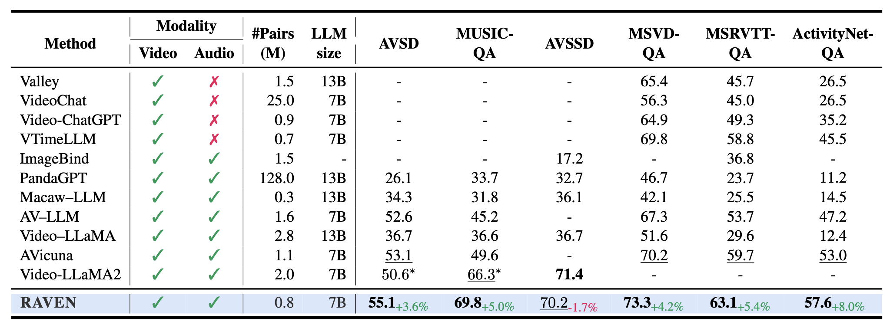

<p align="center">
    
<p>

<h3 align="center">
    <a href="" style="color:#825987">
        RAVEN: Query-Guided Representation Alignment for Question
        Answering over Audio, Video, Embedded Sensors, and Natural Language
    </a>
</h3>


---
## 🚀 Main Results
##### Comparison of **RAVEN** and prior MLLMs on *exocentric* open-ended video QA (MSVD-QA, MSRVTT-QA, ActivityNet-QA) and audio-visual QA (AVSD, MUSIC-QA) benchmarks. Best and second-best scores are in $\textbf{Bold}$ and $\underline{\text{underline}}$. $^*$ indicates scores reproduced by us.
<p></p>

##### Comparison of **RAVEN** with MLLMs on the EgoThink (Reasoning) and AVS-QA benchmarks. **RAVEN** outperforms across metrics and excels in reasoning. $\textbf{Bold}$ and $\underline{\text{underline}}$ indicate the best and second-best scores.
<p></p>

## 🛠️ Requirements and Installation
Basic Dependencies:
* Python >= 3.8
* Pytorch >= 2.2.0
* CUDA Version >= 11.8
* transformers == 4.40.0 (for reproducing paper results)
* tokenizers == 0.19.1

```bash
cd RAVEN
pip install -r requirements.txt
pip install flash-attn==2.5.8 --no-build-isolation
pip install opencv-python==4.5.5.64
apt-get update && apt-get install ffmpeg libsm6 libxext6  -y
```
---

## 📁 **EVS-QA** Dataset
Train and test split of **EVS-QA** is provided [here](./avs-qa-dataset/).<br>
More details [here](./avs-qa-dataset/README.md).

## 🗝️ Training & Evaluation
Coming Soon!

## 🍀 Model Zoo
| Model Name     | Modal Type |
|:----------------|:------------:|
| RAVEN-7B-AV| AV |
| RAVEN-7B-AVS| AVS |

## 🤖 Inference
- **STEP 1:** Download $\texttt{siglip-so400m-patch14-384}$ from here [google/siglip-so400m-patch14-384](https://huggingface.co/google/siglip-so400m-patch14-384) 
- **STEP 2:** Download **RAVEN** checkpoint
```bash
CUDA_VISIBLE_DEVICES=0 python inference.py --model-path=<MODEL PATH> --modal-type=<MODAL TYPE>
```

## 👍 Acknowledgement
The codebase of RAVEN is adapted from [**VideoLLaMA2**](https://github.com/DAMO-NLP-SG/VideoLLaMA2). We are also grateful for their contribution.
